# TrOCR field-level secondary verification

Optional, off-by-default feature: after Azure Document Intelligence
(`prebuilt-check.us`) extracts a cheque's fields, a small set of them can
also be read independently by a locally-run Microsoft TrOCR handwritten
model, purely as a second opinion for a human reviewer. This document
covers what it does, how to configure and run it, and its hard limits.

Read this alongside `CLAUDE.md`'s existing architecture notes - this
feature does not change anything described there about
`extract.py`/`normalize.py`/`rules.py`/`validate.py`'s core pipeline.

## What this is not

- **Not a whole-cheque OCR engine.** TrOCR never sees the full cheque
  image. It only ever receives a crop that Document Intelligence's own
  polygon already tied to one specific field.
- **Not a field detector.** Document Intelligence remains the only
  component that decides "this text is the payee" / "this text is the
  legal amount." TrOCR reads text lines; it does not locate semantic
  cheque fields.
- **Not an autonomous correction engine.** TrOCR can never overwrite a
  Document Intelligence value. Disagreement is recorded and surfaced to a
  human; nothing is silently substituted.
- **Not a majority-voting member.** There are exactly two observations
  (DI, TrOCR) compared by a transparent, documented decision table - never
  a vote, never an average.
- **Not a participant in the deterministic pass/fail rules** in
  `rules.py`. `validate()`'s output is computed first, entirely unchanged;
  OCR verification is attached to the report afterward as advisory data.
- **Does not autonomously approve cheques.** v1 remains reviewer assist -
  every cheque is still routed to a human, exactly as before this feature
  existed.

## Architecture

```mermaid
flowchart TD
    A[Cheque image] --> B[Azure Document Intelligence<br/>prebuilt-check.us]
    B --> C[Structured field values,<br/>confidences, polygons]
    C --> D[validate&#40;&#41; - deterministic rules<br/>UNCHANGED, runs on DI values only]
    C --> E{TrOCR enabled<br/>+ field eligible +<br/>trigger policy says go?}
    E -- no --> F[FieldVerification:<br/>secondary NOT_RUN / SKIPPED]
    E -- yes --> G[geometry.py:<br/>polygon to pixel bbox]
    G -- conversion failed --> F
    G -- ok --> H[crops.py:<br/>validate region, generate crop]
    H -- rejected --> F
    H -- accepted/adjusted --> I[trocr_adapter.py:<br/>local TrOCR inference]
    I --> J[ocr_verify.py:<br/>field-specific normalization]
    J --> K[ocr_verify.py:<br/>comparison / decision engine]
    D --> L[report.py: create_report_record]
    K --> L
    L --> M[reports/cheques.json<br/>immutable audit record]
    M --> N[report.py:<br/>chequemate_report.html<br/>UNCHANGED]
    M --> O[verification_report.py:<br/>chequemate_verification_report.html<br/>NEW]
```



Module map (all under `chequemate/`):

| Module | Responsibility |
|---|---|
| `geometry.py` | The one centralized DI-polygon-to-pixel-bbox converter. Never raises; returns a structured `PixelPolygonResult` with a `ConversionStatus` for every failure mode. |
| `crops.py` | Validates a converted region (area, aspect ratio, optional ROI overlap) and, only if accepted, generates padded, aspect-preserving crop variants (RGB, grayscale, contrast-enhanced, Otsu-binarized - reusing `imageprep.otsu_threshold`, not a second thresholding implementation). |
| `trocr_adapter.py` | Loads the local TrOCR model once per process (thread-safe), runs inference under `torch.inference_mode()`, returns a structured result. `torch`/`transformers` are imported lazily so the rest of the pipeline works with them absent. |
| `ocr_verify.py` | The policy layer: `TrOCRVerificationConfig`, field-specific normalization (payee/legal amount/memo), the transparent comparison/decision engine, and `verify_cheque_fields()` orchestration. |
| `verification_report.py` | Renders the new, additive "ChequeMate AI Review and OCR Verification Report" HTML from the same `reports/cheques.json` records `report.py` already produces. |

## Configuration

Single configuration surface: `chequemate.ocr_verify.TrOCRVerificationConfig`
(a frozen dataclass, same pattern as `rules.Config`). Build one directly, or
via `ocr_verify.config_from_env()` which reads these environment variables
(load `.env` first via `run_batch.load_dotenv()` if you want `.env` support -
same convention as `AZURE_DI_ENDPOINT`/`AZURE_DI_KEY`):

| Variable | Default | Meaning |
|---|---|---|
| `CHEQUEMATE_TROCR_ENABLED` | `false` | Master switch. `false` = zero behavior change from before this feature existed. |
| `CHEQUEMATE_TROCR_MODEL` | `microsoft/trocr-base-handwritten` | Hugging Face model id, or a local path (see below). |
| `CHEQUEMATE_TROCR_LOCAL_MODEL_PATH` | unset | If set, overrides `CHEQUEMATE_TROCR_MODEL` with an explicit local filesystem path - production's "use pre-approved, pre-downloaded weights" path. |
| `CHEQUEMATE_TROCR_MODEL_REVISION` | unset | Pin an exact model revision hash. **Set this in production** (see `docs/licensing_provenance.md`). |
| `CHEQUEMATE_TROCR_DEVICE` | `auto` | `auto` \| `cpu` \| `cuda`. `auto` uses CUDA only if `torch.cuda.is_available()`; requesting `cuda` explicitly on a machine without it is a load failure, never a silent fallback to CPU. |
| `CHEQUEMATE_TROCR_TRIGGER_POLICY` | `always_on_eligible_fields` | `disabled` \| `always_on_eligible_fields` \| `low_confidence_only` \| `handwritten_or_low_confidence`. The last two are currently identical - no handwriting classifier exists in this repo, and none was invented for this feature. |
| `CHEQUEMATE_TROCR_LOCAL_FILES_ONLY` | `false` | `true` in production: `from_pretrained` never attempts a network call; a cache miss is a clean load failure, not a download. |
| `CHEQUEMATE_TROCR_DEBUG_RETAIN_CROPS` | `false` | Persist the crop actually sent to TrOCR to `debug/trocr_crops/` (already gitignored) for audit. Off by default. |
| `CHEQUEMATE_TROCR_MAX_NEW_TOKENS` | `32` | Generation length cap. |

Other knobs (`eligible_fields`, `field_confidence_thresholds`,
`crop_configs` per field, `payee_edit_tolerance`, `expected_payee`) are
constructor arguments on `TrOCRVerificationConfig`, not yet environment
variables - set them by building the config in code (see
`scripts/run_batch.py`'s `--trocr` flag for the pattern).

### CLI

```powershell
# TrOCR off (default) - identical behaviour to before this feature existed
.\.venv\Scripts\python.exe scripts\run_batch.py

# TrOCR on for newly-processed images
.\.venv\Scripts\python.exe scripts\run_batch.py --trocr
```

## Local model setup

1. **Install the optional dependencies** (not required unless TrOCR is
   enabled): `pip install -r requirements.txt` (this now includes
   `torch`/`transformers`/`sentencepiece`/`safetensors` - see
   `docs/licensing_provenance.md` for exact pinned versions and licenses).
2. **Download the weights once**, with network access, in an approved
   setup step (this is the one time `local_files_only=False` is
   appropriate):
   ```powershell
   .\.venv\Scripts\python.exe -c "
   from transformers import TrOCRProcessor, VisionEncoderDecoderModel
   TrOCRProcessor.from_pretrained('microsoft/trocr-base-handwritten')
   VisionEncoderDecoderModel.from_pretrained('microsoft/trocr-base-handwritten')
   "
   ```
   This populates the Hugging Face cache (`~/.cache/huggingface` by
   default - already covered by `.gitignore`).
3. **Resolve and pin an exact revision** for production (see
   `docs/licensing_provenance.md`'s "Revision pinning" section) - set
   `CHEQUEMATE_TROCR_MODEL_REVISION` to that hash.

### Offline / production setup

Production should never attempt a network call at runtime:

```powershell
$env:CHEQUEMATE_TROCR_ENABLED = "true"
$env:CHEQUEMATE_TROCR_LOCAL_FILES_ONLY = "true"
$env:CHEQUEMATE_TROCR_MODEL_REVISION = "<pinned commit hash>"
# Optional: point at a pre-approved local copy instead of the HF cache
$env:CHEQUEMATE_TROCR_LOCAL_MODEL_PATH = "C:\models\trocr-base-handwritten"
```

With `local_files_only=true` and no cached/local weights present, model
load fails cleanly (`TrOCRStatus.FAILED`, `error_code="model_load_failed:..."`)
- it does not hang, retry indefinitely, or fall back to a network call.

**Known cold-start cost**: the first TrOCR call in a process measured
~15s on this machine with the pinned `transformers==4.57.6` (worse, ~25-30s,
was measured against `transformers==5.16.1` before that incompatibility was
found and fixed - see the pin's comment in `requirements.txt`), almost
entirely from `transformers`' own lazy import of
`TrOCRProcessor`/`VisionEncoderDecoderModel`, not model-weight loading or
network access. This is exactly why the model client is cached once per
process (`ocr_verify.get_or_create_client`) rather than re-created per
field or per cheque.

## How field crops are generated

1. `geometry.convert_bounding_region_to_pixels()` turns Document
   Intelligence's polygon (whatever unit it's declared in - `pixel` or
   `inch`, confirmed against a real captured response in
   `raw/20260820113647241_0024.json`) into a pixel bounding box on the
   *actual* source image, proportionally scaled - never assumed to already
   be pixels.
2. `crops.validate_and_generate_crop()` rejects the region if it's too
   small, too large a fraction of the cheque, an implausible aspect ratio
   for that field, or (when an expected region of interest has actually
   been configured and calibrated for that field - none is, by default,
   for payee/amount/memo; see the warning below) too far outside it.
3. Only an accepted region is padded (aspect-ratio-preserving, configurable
   fraction) and cropped in one or more preprocessing variants.
4. Exactly one variant per field is sent to TrOCR (the first configured
   one that produces usable text) - multiple variants, when configured,
   are additional observations from the *same* model, never separate
   voters.

**Deliberately no default expected-ROI rectangle for payee/amount/memo.**
This codebase already has a real, documented incident from fixing a
similar rectangle by eyeballing a contact sheet
(`chequemate/signature.py`'s original `SIGNATURE_ZONE_FRAC`, which produced
a confirmed false positive on a different cheque template - see
`CLAUDE.md`). `FieldCropConfig.expected_roi_frac` defaults to `None`
(check skipped) until it is actually calibrated against a labeled batch
for that specific field, the same way `signature.py`'s zone is now
*derived* from a located line rather than assumed.

## Supported verification fields

`payee`, `amount_words` (the legal/written amount - `check_amounts_match`'s
existing courtesy-vs-legal cross-check in `rules.py` is untouched and
keeps running independently), and `memo` (only where a printed/handwritten
crop is available at all - Azure's own `Memo` field, when present).

**Never eligible, categorically** (enforced in code via
`ocr_verify.NEVER_ELIGIBLE_FIELDS`, not just by leaving them out of a
config default): full MICR line, the complete cheque image, bank name,
bank address, signature authenticity, logos, routing symbols. Signature
presence detection (`chequemate/signature.py`) is completely untouched by
this feature.

## Confidence terminology

| Term | Meaning |
|---|---|
| Document Intelligence confidence | Azure's own per-field confidence score. Unchanged, unrelated to anything below. |
| TrOCR raw generation evidence | Mean per-token softmax probability from greedy decoding (`score_type="raw_generation_evidence"`). **Not a calibrated probability of correctness** - no calibration procedure against held-out labeled cheque fields exists in this repo. |
| TrOCR score = `null` / `"unavailable"` | No score could be computed (or scoring itself failed) - shown as **"Not calibrated"** in the report, never as a percentage or a fabricated number. |
| Text agreement | Whether DI's and TrOCR's normalized text match (`AGREE_EXACT` / `AGREE_NORMALIZED`) - evidence of consistency, not proof of correctness. |
| Allowlist match | Whether a value matches the configured expected payee via the *same* token/edit-distance test `rules.check_payee` already uses (`AGREE_ALLOWLIST` when both sides independently match despite differing spelling - the spelling difference is still shown, never hidden). |
| Manual review recommendation | `comparison.manual_review_required` - a field-level flag distinct from the record's overall `Verdict`, driven entirely by the decision table below. |

## Interpretation of agreement / disagreement

`ocr_verify.compare_field()` is a fixed, priority-ordered decision table
(the full reasoning is in that function's docstring) producing one of ten
`ComparisonStatus` values: `AGREE_EXACT`, `AGREE_NORMALIZED`,
`AGREE_ALLOWLIST`, `DISAGREE`, `DI_ONLY`, `TROCR_ONLY`, `CROP_REJECTED`,
`TROCR_NOT_RUN`, `TROCR_FAILED`, `BOTH_UNDETERMINED`. In every case, the
authoritative `selected_display_value` stays Document Intelligence's own
value (even when that's empty) - TrOCR's reading is never promoted, only
shown alongside as evidence. `DISAGREE` and `BOTH_UNDETERMINED` are the
only two statuses requiring manual review purely because of OCR data - all
others either agree (no extra review need) or represent a normal
"secondary verification unavailable" outcome.

## Privacy behaviour

- TrOCR inference is 100% local. No cheque crop is ever sent to Hugging
  Face's hosted inference API or any other network endpoint - see
  `chequemate/trocr_adapter.py`'s module docstring and
  `tests/test_ocr_verify.py::test_verify_cheque_fields_never_sends_full_cheque_dimensions_to_trocr` /
  `tests/test_trocr_integration.py`'s equivalent full-pipeline check.
- Debug crop retention (`CHEQUEMATE_TROCR_DEBUG_RETAIN_CROPS`) defaults to
  `false`. When enabled, crops are written under `debug/` (already
  gitignored) - never elsewhere, never automatically included in a report
  beyond a file-path reference.
- The verification report never embeds crop image bytes - only pixel
  bounding boxes, crop status, and (when debug retention is on) a local
  file-path reference, matching `report.py`'s existing "never embed cheque
  image bytes" policy for the main dashboard.
- No MICR data or account numbers are ever extracted or stored by this
  feature (they aren't stored by the rest of the pipeline either - see
  `report.py`'s privacy boundary).
- Model weights are downloaded once during approved setup; runtime cheque
  images never leave the local machine.

## Report fields

See `chequemate/verification_report.py` for the full template. Each
record shows: selected display value, DI's primary value + confidence,
TrOCR's value + honestly-labeled score, agreement status, crop validation
status (with the actual validation reason recorded, not just a status
code), manual-review flag, reason codes, and a plain-language reviewer
instruction per field - plus the complete, unmodified deterministic rule
results section, visually distinct from OCR-only findings.

## Troubleshooting

| Symptom | Likely cause | Fix |
|---|---|---|
| Every field shows `TROCR_NOT_RUN` | `raw_response` passed to `verify_cheque_fields()` has no `boundingRegions`/`pages` (e.g. an old cached raw JSON captured before your Azure model returned polygons) | Re-capture with `--save-raw`; confirm `pages[]` exists in the saved JSON. |
| `TROCR_FAILED` with `model_load_failed:OSError` | No cached weights and `local_files_only=true`, or an invalid model path | Run the local model setup step above, or check `CHEQUEMATE_TROCR_LOCAL_MODEL_PATH`. |
| Every crop is `REJECTED` for one field | `FieldCropConfig` thresholds don't match that field's real geometry on your cheque template | Inspect the `validation_reasons` in the report's crop-evidence panel first - it names the exact failing check. |
| First call is very slow | Cold `transformers` import (~15s measured with the pinned 4.x version, not a hang) | Expected once per process; the client is cached afterward. |
| `TrOCRProcessor.from_pretrained` raises "Couldn't instantiate the backend tokenizer... need sentencepiece or tiktoken" even with `sentencepiece` installed | `transformers` was upgraded past the pinned 4.x line (a real, confirmed incompatibility in 5.x's tokenizer resolution for this model) | `pip install -r requirements.txt` to restore the pin; never bump `transformers` to 5.x without re-verifying against real weights first. |

## Test commands

```powershell
.\.venv\Scripts\python.exe -m pytest tests/test_geometry.py tests/test_crops.py `
    tests/test_trocr_adapter.py tests/test_ocr_verify.py `
    tests/test_verification_report.py tests/test_trocr_integration.py -q

# full suite (includes everything above plus the pre-existing pipeline tests)
.\.venv\Scripts\python.exe -m pytest -q
```

## Evaluation command

```powershell
.\.venv\Scripts\python.exe scripts\evaluate_trocr.py
.\.venv\Scripts\python.exe scripts\evaluate_trocr.py --save-baseline   # record a regression baseline
```

Reports per-field crop acceptance / TrOCR completion / exact / normalized /
allowlist agreement / disagreement rates, plus ground-truth exact-match
rates when `tests/ground_truth.json` has hand-keyed values for that field.
Labeled "agreement analysis" instead of "accuracy" for any field with no
ground truth yet - never a fabricated accuracy number.

## Rollback procedure

Set `CHEQUEMATE_TROCR_ENABLED=false` (the default) or omit `--trocr` from
`run_batch.py` - `verify_cheque_fields()` returns `{}` immediately,
`ocr_verifications` is `None` on every new record, and
`chequemate_report.html` (the original dashboard) is completely
unaffected; it was never modified by this feature. The new
`chequemate_verification_report.html` keeps regenerating (harmlessly
showing "not run" for every field) but can be ignored or deleted - nothing
reads it back into the pipeline.

A TrOCR model-load failure or a field-level inference exception never
propagates past `ocr_verify.verify_cheque_fields()` / `trocr_adapter.run_trocr()`
- both catch and convert failures into a structured `FAILED` observation,
so Document Intelligence extraction and the deterministic rules always
complete regardless of TrOCR's health.

## Known limitations

- **No calibrated TrOCR confidence exists.** Every score shown is either
  `null` ("Not calibrated") or raw per-token generation evidence,
  explicitly labeled as such.
- **No expected-ROI rectangle is calibrated for payee/amount/memo yet**
  (unlike `signature.py`'s line-derived zone) - `expected_roi_frac` is
  `None` by default; the crop validation layer still catches genuinely bad
  regions via area/aspect-ratio checks alone (demonstrated for real on
  `20260820113647241_0024.png`'s skewed `WordAmount` polygon during this
  feature's own testing).
- **No roll-number format is enforced for `memo`** - none is defined
  anywhere else in this repository, and one was not invented for this
  feature (per the explicit instruction that produced it).
- **`transformers` must stay pinned to the 4.x line, not 5.x.**
  `transformers==5.16.1` (the initially-resolved "latest compatible"
  version) cannot load `microsoft/trocr-base-handwritten`'s tokenizer at
  all - confirmed by hand against the real model, not a hypothetical. See
  `requirements.txt`'s comment before ever bumping this dependency.
- **Real end-to-end TrOCR inference has been run and validated** against
  the actual downloaded model weights (not just injected fakes) via
  `scripts/apply_trocr_verification.py` against this repo's full real
  cheque corpus - see that script and `scripts/backfill_raw_responses.py`
  for the one-time historical-backfill path used to do this.
- **Whole-cheque rotation is corrected before cropping.** This repo's
  entire real corpus is stored portrait (~90 degrees off from upright);
  early testing of this feature initially produced near-universal false
  crop rejections because of this (every field's aspect ratio came out
  transposed). Fixed via `imageprep.detect_rotation_only()` +
  `ocr_verify.resolve_rotation()` / `crops.py`'s `rotation` parameter -
  see those modules' docstrings for the exact approach (crop from the
  original un-rotated image using DI's own coordinates unchanged, then
  physically rotate just the small crop, rather than transforming polygon
  coordinates through imageprep's full pipeline). A file the rotation
  detector cannot confidently resolve is refused (`TROCR_NOT_RUN`), never
  guessed at; a file a human has already confirmed via
  `scripts/apply_rotation_override.py` reuses that confirmation
  (`rotation_override`) rather than re-refusing.
- **Historical records lack recoverable polygon data unless backfilled.**
  Verification can only run at ingestion time (inside `run_batch.py`'s
  `process_one()`, which has the full raw Azure response in scope) or
  after `scripts/backfill_raw_responses.py` re-fetches it (one real Azure
  call per file) for cheques processed before `--save-raw` existed. Two
  records in this repo's own history (`cheque1.json`/`cheque2.json`) have
  no recoverable source image at all and can never be backfilled.
- **`always_on_eligible_fields` is the current default trigger policy**
  for newly-enabled use, not `low_confidence_only` - reviewers should pick
  the policy that matches their actual operational cost/latency tolerance
  via `CHEQUEMATE_TROCR_TRIGGER_POLICY`.
